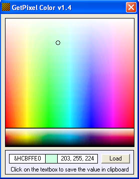



## GetPixel Color \(colorpicker for programmers\)

### Description

I made this couse I got sick of opening those huge programs just to get one color value :) FEATURES ARE: Click on picture to get the color,

You get HEX(vb) and RGB color, By clicking on a textbox with the value, it's copied to clipboard, LOAD button for loading your own pictures.     ################

I hope I helped, Have fun! :)
 
### More Info
 

             |
---                |---
**Submitted On**   |2005-01-22 04:13:02
**By**             |[Edi Budimilic](https://github.com/Planet-Source-Code/PSCIndex/blob/master/ByAuthor/edi-budimilic.md)
**Level**          |Beginner
**User Rating**    |4.4 (22 globes from 5 users)
**Compatibility**  |VB 5\.0, VB 6\.0
**Category**       |[Graphics](https://github.com/Planet-Source-Code/PSCIndex/blob/master/ByCategory/graphics__1-46.md)
**World**          |[Visual Basic](https://github.com/Planet-Source-Code/PSCIndex/blob/master/ByWorld/visual-basic.md)
**Archive File**   |[GetPixel\_C1842741222005\.zip](https://github.com/Planet-Source-Code/edi-budimilic-getpixel-color-colorpicker-for-programmers__1-58432/archive/master.zip)

